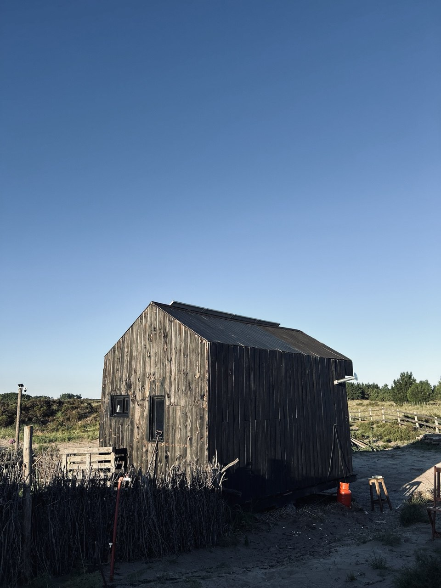

# Recharge Retreat

A digital disconnection experience in the Argentine dunes.



## About

Recharge Retreat is a self-sufficient shelter located on 9 private hectares of green dunes near the Argentine Atlantic coast. This website showcases a unique accommodation experience designed for complete digital disconnection and recharging.

### Features

- **Self-Sufficient Shelter** - Solar-powered cabin with modern amenities
- **Private Nature Reserve** - 9 hectares of pristine dunes and native flora  
- **Digital Detox** - No WiFi, complete disconnection from modern distractions
- **Premium Location** - Steps from Faro Querandí Ecological Reserve
- **Ocean Access** - 3km from completely empty beaches

### Website Features

- **Responsive Design** - Mobile-first approach with beautiful layouts
- **Interactive Galleries** - CSS Grid masonry for natural photo arrangements
- **Modern Architecture** - Built with Next.js 15, TypeScript, and Tailwind CSS
- **Performance Optimized** - Fast loading times and smooth user experience
- **Bilingual Ready** - Structured for Spanish/English content management

## Tech Stack

- **Framework**: Next.js 15 with App Router
- **Language**: TypeScript
- **Styling**: Tailwind CSS
- **UI Components**: Radix UI with shadcn/ui
- **Images**: Next.js Image optimization
- **Gallery**: CSS Grid masonry layouts
- **Icons**: Lucide React

## Getting Started

```bash
# Install dependencies
npm install

# Run development server
npm run dev

# Build for production
npm run build

# Start production server
npm start
```

## Project Structure

```
├── app/                 # Next.js app router pages
│   ├── page.tsx        # Homepage
│   ├── shelter/        # Shelter information
│   ├── activities/     # Activities page
│   ├── land/          # Property details
│   └── book/          # Booking page
├── components/         # Reusable UI components
├── public/images/     # Image assets organized by category
│   ├── shelter/       # Cabin exterior/interior
│   ├── comfort/       # Amenities and facilities
│   ├── plants/        # Flora and nature
│   └── aereo/         # Aerial views
└── lib/               # Utility functions
```

## Development

The project emphasizes clean, semantic HTML and modern CSS practices. The masonry galleries use CSS Grid with native masonry support and CSS columns fallback for maximum browser compatibility.

## Portfolio

This project is part of a portfolio of location-based hospitality websites:

- **[Il Buco](https://ilbuco.com.ar)** - Italian villa with urban connectivity
- **[AI & Tractors](https://aiandtractors.com)** - Digital innovation blog

## License

Private project for Recharge Retreat accommodation business.