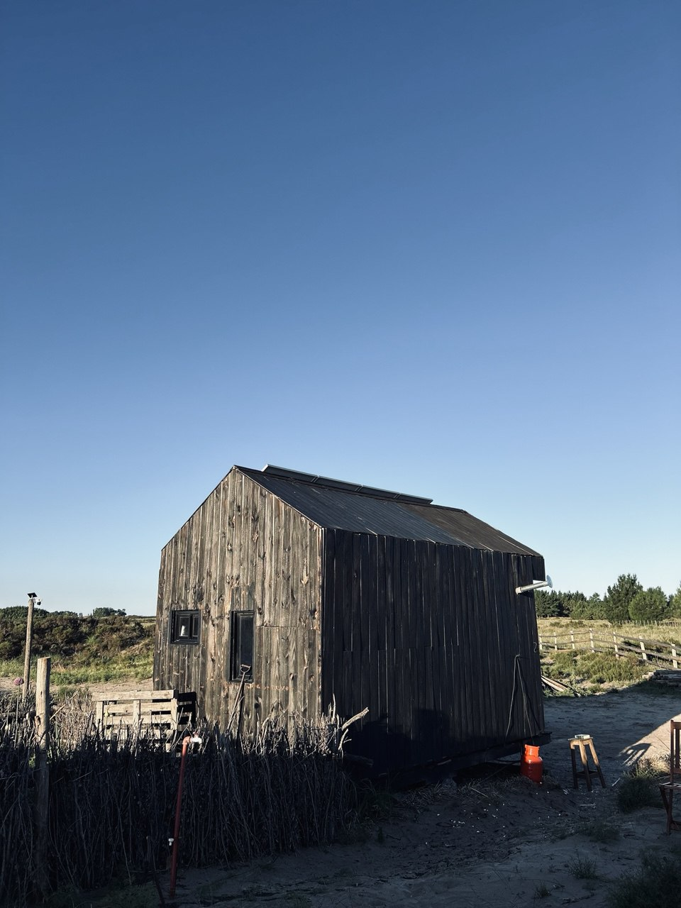

# Recharge Retreat

A digital disconnection experience in the Argentine dunes.

Marketing site for the Recharge Retreat shelter — a self-sufficient cabin on 9 private hectares of dunes near Faro Querandí, Argentina. Trilingual (Spanish / English / Portuguese) Next.js app deployed at [recharge.com.ar](https://recharge.com.ar).



## How it works

- **Next.js 15 App Router, fully static** — no database, no user data, no API routes. Every page lives under `app/[locale]/`: home, shelter, land, activities, location, book, flora-faro-querandi, alquiler-cabana-mar-azul (the Mar Azul cabin rental), plus four English-only SEO landing pages (argentina-shelter, survival-shelters-argentina, survival-bunker-argentina, bunker-argentina).
- **Languages via next-intl** — `middleware.ts` serves Spanish (default) at `/` → `/es`, English at `/en`, Portuguese at `/pt`; unknown or missing locales fall back to Spanish (`i18n/request.ts`).
- **UI strings live in `messages/{es,en,pt}.json`** and reach components through a custom `TranslationProvider` (`components/translation-provider.tsx`) with dot-key `t()` lookups; long-form page copy is written directly in the page components.
- **Language choice persists in a `NEXT_LOCALE` cookie** (1 year), set by the header language switcher (`components/language-switcher.tsx`); per the language policy in `CLAUDE.md`, the first visit resolves by visitor geography and unknown countries default to English.
- **SEO headers come from middleware** — every page emits its own canonical plus es/en/pt hreflang alternates as an HTTP `Link` header pointing at `https://recharge.com.ar` (`middleware.ts`); redirect responses carry none.
- **Images are static files in `public/images/`**, served unoptimized (`images.unoptimized` in `next.config.mjs`). Galleries are grid/masonry components (`components/`) using yet-another-react-lightbox for zoom; aerial shots are always zoomable (image policy in `CLAUDE.md`).
- **UI scaffold is shadcn/ui + Tailwind** — primitives in `components/ui/`, theme via `next-themes` and CSS variables (`app/globals.css`).
- **Sale banner** — the "temporarily not renting / for sale USD 400.000" state lives under the `saleBanner` key of the message files and renders in the navigation (`components/navigation.tsx`).
- **`src/flora-querandi/` is source material** (an Evernote export of flora research for the flora page), not application code.

## How to run

```bash
npm install
npm run dev        # http://localhost:3010 (port fixed in package.json)
```

Production build: `npm run build`, then `npm start`.

## How to test

```bash
~/.claude/bin/local-ci      # = sh scripts/local_ci.sh
```

Builds for production, starts `next start` on a free port and requests every page in `es`, `en` and `pt` (36 requests); each must return 200 with a `<title>`. Routes come from `app/[locale]/**/page.tsx`, so a new page is covered automatically. No hosted CI. `npm run lint` is not part of the gate: there is no ESLint config and it stops at an interactive prompt. `tsc --noEmit` is not either: it reports 4 existing errors (missing `masonry-layout` / `imagesloaded` types, next-intl request config) that the build ignores.

Then review the rendered pages of everything you touched at http://localhost:3010, in all three locales. Vercel builds `main` on push — a change is done when verified on the live recharge.com.ar URL.

## About

Recharge Retreat is a self-sufficient shelter located on 9 private hectares of green dunes near the Argentine Atlantic coast. This website showcases a unique accommodation experience designed for complete digital disconnection and recharging.

### Features

- **Self-Sufficient Shelter** - Solar-powered cabin with modern amenities
- **Private Nature Reserve** - 9 hectares of pristine dunes and native flora  
- **Digital Detox** - No WiFi, complete disconnection from modern distractions
- **Premium Location** - Steps from Faro Querandí Ecological Reserve
- **Ocean Access** - 3km from completely empty beaches


## Other development and credits

Our other, very different property is [Il Buco](https://ilbuco.com.ar) - a high-end villa in Carilo. Houses and websites are built by [Ivan Braun, AI entrepreneur](https://aiandtractors.com). 
